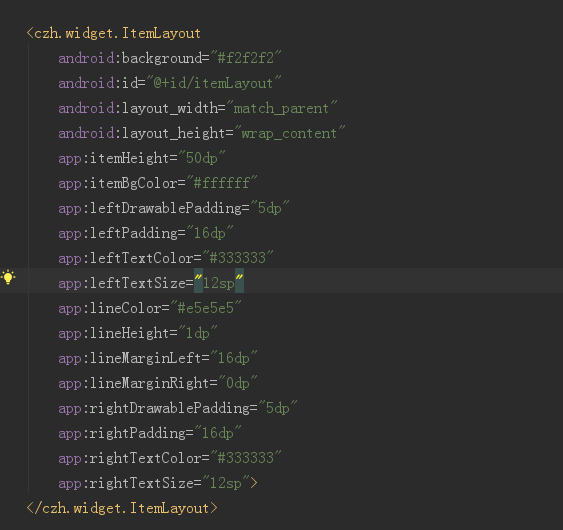
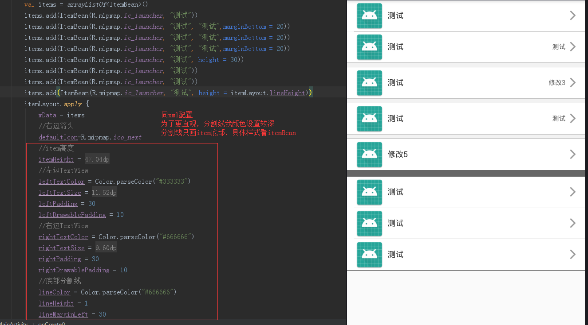

## ItemLayout

一行代码链式调用，实现通用item布局


use Gradle:

```
repositories {
  maven { url "https://jitpack.io" }
  mavenCentral()
  google()
}
dependencies {
  implementation 'com.github.czh235285:FastKotlin:1.4.2'
}


```
## 介绍


## xml中


## 代码中

